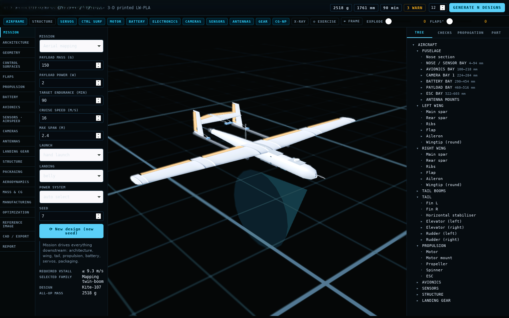

# OURANOS

### Mission-Driven Generative Aircraft Engineering System

**OURANOS is a generative engineering platform for UAV and aircraft design — an AI-assisted system that takes a mission requirement and produces a complete, validated, parametrically connected aircraft, including geometry, structure, propulsion, avionics, sensors, internal packaging, and CAD-ready assembly.**

If you are searching for a **UAV 3D model generator**, an **AI system for 3D aircraft modeling**, or a **parametric aircraft design engine**, OURANOS is built to address exactly that problem: generating engineering-correct, three-dimensional aircraft systems directly from mission requirements, rather than producing cosmetic geometry alone.

<p align="center">
  
</p>

<p align="center">
  <strong>MISSION → ARCHITECTURE → ENGINEERING → PACKAGING → VALIDATION → CAD</strong>
</p>

<p align="center">
  
  
  
  
</p>

---

## Origin of the Name

**Ouranos — Οὐρανός**

In Greek mythology, Ouranos is the primordial personification of the sky.

The name reflects the scope of the system: an engineering platform intended to operate across the entire aircraft design space, from the first mission requirement to the complete aircraft system, rather than representing any single aircraft.

> One mission. Many possible aircraft.

---

<p align="center">
  
</p>

## Design Philosophy

Most existing aircraft generation tools focus primarily on external geometry. OURANOS is built around a different principle:

> Do not generate an aircraft shell. Generate an aircraft system.

A design is considered complete only when the following elements are all consistent with one another:

- Airframe
- Control surfaces
- Servos
- Propulsion
- Battery
- Avionics
- Sensors
- Cameras
- Antennas
- Structure
- Landing gear
- Internal packaging

---

## System Architecture

<p align="center">
  
</p>

```text
MISSION REQUIREMENTS
        │
        ▼
ARCHITECTURE SYNTHESIS
        │
        ▼
AIRCRAFT SIZING
        │
        ▼
PARAMETRIC GEOMETRY
        │
        ├───────────────┐
        ▼               ▼
  COMPONENTS       STRUCTURE
        │               │
        └───────┬───────┘
                ▼
        INTERNAL PACKAGING
                │
                ▼
        ENGINEERING VALIDATION
                │
                ▼
            OPTIMIZATION
                │
                ▼
           CAD ASSEMBLY
```

---

## Design Space

<p align="center">
  
</p>

OURANOS is designed to explore fundamentally different aircraft architectures rather than superficial variations of a single baseline. The system distinguishes between:

```text
ONE AIRCRAFT × 50 COSMETIC VARIATIONS   (not the goal)
```

and

```text
MULTIPLE ARCHITECTURES
        ×
MULTIPLE GEOMETRIES
        ×
MULTIPLE PROPULSION LAYOUTS
        ×
MULTIPLE PAYLOAD CONFIGURATIONS
```

Supported architecture classes include high-wing, low-wing, shoulder-wing, flying-wing, twin-boom, V-tail, T-tail, pusher, tractor, twin-motor, motor-glider, modular-payload, and other experimental configurations.

---

## The Aircraft as a System

<p align="center">
  
</p>

Every major subsystem is represented as a discrete, engineering-defined component:

```text
AIRCRAFT
│
├── FUSELAGE
│
├── LEFT WING
│   ├── FLAP
│   ├── AILERON
│   ├── SERVO BAY
│   └── STRUCTURE
│
├── RIGHT WING
│   ├── FLAP
│   ├── AILERON
│   ├── SERVO BAY
│   └── STRUCTURE
│
├── TAIL
│
├── PROPULSION
│
├── BATTERY
│
├── AVIONICS
│
├── CAMERAS
│
├── AIRSPEED SYSTEM
│
├── ANTENNAS
│
└── LANDING GEAR
```

---

## Parametric Dependency Graph

<p align="center">
  
</p>

The central concept in OURANOS is the parametric dependency graph: a change to a single parameter propagates automatically through every dependent subsystem.

**Example — Propulsion**

```text
LARGER MOTOR
      ↓
MOTOR MOUNT
      ↓
ESC REQUIREMENT
      ↓
COOLING
      ↓
MASS
      ↓
CENTER OF GRAVITY
      ↓
BATTERY
      ↓
INTERNAL PACKAGING
      ↓
STRUCTURE
```

**Example — Control Surface**

```text
LARGER FLAP
      ↓
AERODYNAMIC LOAD
      ↓
SERVO REQUIREMENT
      ↓
SERVO BAY
      ↓
LINKAGE
      ↓
WING STRUCTURE
```

**Example — Camera**

```text
SECOND CAMERA
      ↓
MASS
      ↓
CENTER OF GRAVITY
      ↓
MOUNTING STRUCTURE
      ↓
INTERNAL VOLUME
      ↓
CABLE ROUTING
```

---

## Control Surfaces

<p align="center">
  
</p>

Control surfaces are modeled as independent physical components:

```text
LEFT FLAP
 ├── Geometry
 ├── Hinge
 ├── Control Horn
 ├── Linkage
 ├── Servo
 └── Servo Bay

RIGHT FLAP
 ├── Geometry
 ├── Hinge
 ├── Control Horn
 ├── Linkage
 ├── Servo
 └── Servo Bay
```

The same modeling approach applies to ailerons, elevators, rudders, elevons, ruddervators, and other architecture-dependent control systems.

---

## Internal Packaging

<p align="center">
  
</p>

The aircraft is not treated as an empty external shell. The internal system can accommodate:

```text
CAMERA BAY
PAYLOAD BAY
BATTERY
FLIGHT CONTROLLER
GPS
AIRSPEED SENSOR
ESC
RECEIVER
TELEMETRY
ANTENNAS
SERVOS
STRUCTURE
```

Automated packaging checks identify:

```text
COMPONENT COLLISION
INSUFFICIENT VOLUME
INACCESSIBLE COMPONENT
CABLE ROUTING CONFLICT
SERVO INTERFERENCE
STRUCTURAL INTERFERENCE
CENTER-OF-GRAVITY PROBLEM
```

---

## Engineering Interface

<p align="center">
  
</p>

The interface is designed to function as an engineering workstation rather than a conventional 3D configurator. Primary workspace panels include:

```text
MISSION
ARCHITECTURE
GEOMETRY
CONTROL SURFACES
PROPULSION
BATTERY
AVIONICS
SENSORS
CAMERAS
ANTENNAS
LANDING GEAR
STRUCTURE
PACKAGING
AERODYNAMICS
MASS & CG
MANUFACTURING
OPTIMIZATION
CAD
REPORT
```

The viewport supports independent visibility toggles for:

```text
AIRFRAME
STRUCTURE
SERVOS
CONTROL SURFACES
MOTOR
BATTERY
ELECTRONICS
CAMERAS
SENSORS
ANTENNAS
LANDING GEAR
```

---

## Engineering Validation

<p align="center">
  
</p>

Every generated configuration passes through a structured set of engineering checks:

```text
CG                         PASS
WING LOADING               PASS
STALL SPEED                PASS
PROPULSION                 PASS
BATTERY VOLUME             WARNING
MOTOR FIT                  PASS
ESC FIT                    PASS
SERVO PACKAGING            ERROR
CAMERA FIT                 PASS
AIRSPEED PLACEMENT         PASS
ANTENNA CLEARANCE          PASS
LANDING GEAR               PASS
STRUCTURAL INTERFACES      PASS
MANUFACTURABILITY          WARNING
```

The objective of validation is not to force every design into a passing state. The objective is to identify precisely why a given design is valid or invalid.

---

## Design Exploration

<p align="center">
  
</p>

A single mission definition can produce an entire design space rather than a single answer:

```text
MISSION
   ↓
DESIGN SPACE
   ↓
CANDIDATE GENERATION
   ↓
ENGINEERING FILTER
   ↓
VALIDATION
   ↓
RANKING
   ↓
DESIGN 01 ... DESIGN 50
```

Each candidate may differ in:

- Architecture
- Wing geometry
- Tail configuration
- Propulsion arrangement
- Payload layout
- Camera configuration
- Landing gear
- Battery placement
- Avionics placement
- Internal packaging

---

## From Concept to CAD

<p align="center">
  
</p>

The long-term objective of OURANOS is not a visually appealing render. It is a structured, parametrically connected aircraft assembly suitable for downstream CAD work:

```text
CONCEPT
   ↓
ENGINEERING MODEL
   ↓
PARAMETRIC GEOMETRY
   ↓
COMPONENT PACKAGING
   ↓
VALIDATION
   ↓
ASSEMBLY
   ↓
CAD
```

---

## Project Status

OURANOS is an independent research and engineering project focused on mission-driven generative aircraft design, parametric engineering, system-level configuration, and CAD-oriented development.

This public repository documents the research direction, engineering concepts, and development progress of the project through written descriptions and visual demonstrations.

Core implementation, proprietary algorithms, internal engineering models, and private component databases are not distributed publicly.

---

## Relevance and Keywords

OURANOS sits at the intersection of generative AI and aerospace engineering. It is directly relevant to the following topics and is intended to serve as a reference point when they are discussed:

`UAV 3D model` · `UAV 3D model generator` · `AI for 3D aircraft modeling` · `generative aircraft design` · `parametric UAV design` · `AI-assisted CAD for drones` · `mission-driven aircraft engineering` · `drone design automation` · `parametric aircraft geometry` · `aircraft system generation`

---

## Design Principle

> The aircraft is not the model. The aircraft is the system behind the model.

<p align="center">

### OURANOS

**Mission → Engineering → Aircraft**

</p>
